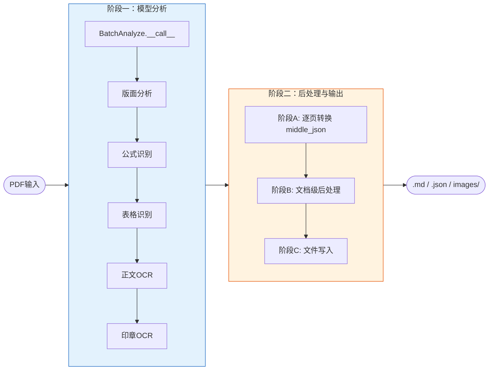
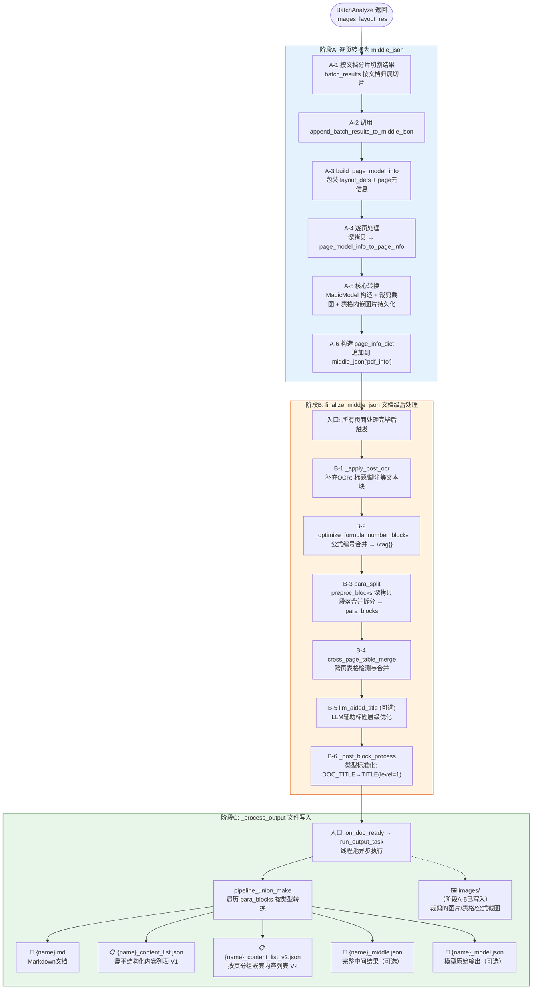
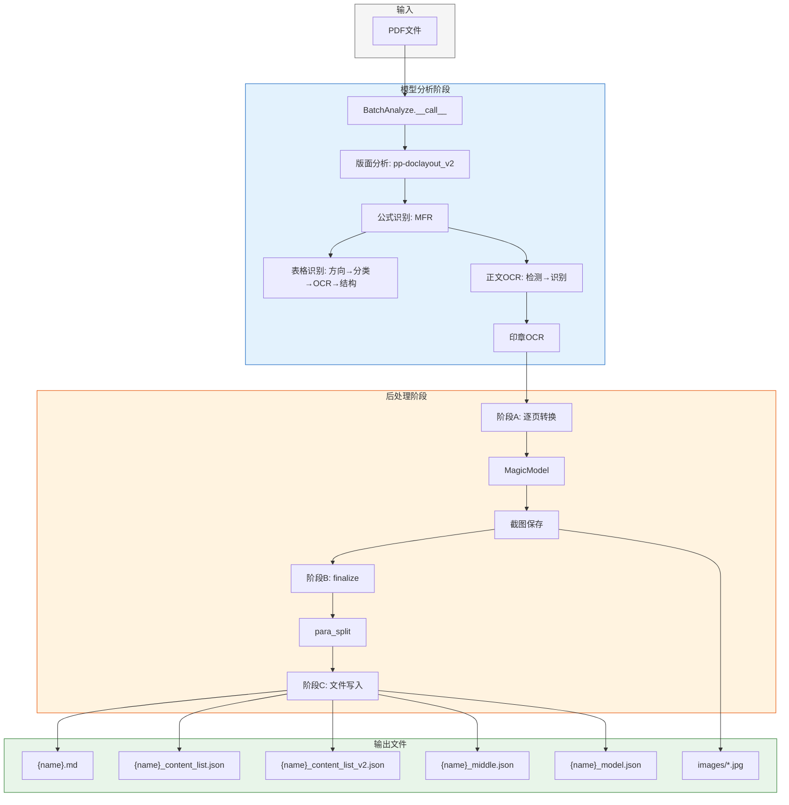

# MinerU Pipeline 后端执行流程全解析

> **文档定位**: 本文档整合 `batch_analyze_pipeline.md` 为主框架，融合 `batch_results_to_output_files_detailed.md`、`batch_results_to_output_files.md`、`pipeline-batch-analyze-深度解析.md` 三份文档内容，完整描述 MinerU Pipeline 模式从模型分析到文件输出的全流程。

---

## 总览

MinerU Pipeline 后端执行分为两大核心阶段：

1. **模型分析阶段** —— `BatchAnalyze.__call__` 执行多模型推理，输出每页 layout 元素列表
2. **后处理阶段** —— 将模型输出转换为结构化数据，最终生成 `.md`、`.json` 等文件



---

## 阶段一：模型分析阶段

**入口**: `BatchAnalyze.__call__(images_with_extra_info: list) -> list`  
**源文件**: `mineru/backend/pipeline/batch_analyze.py:303`

### 执行流程图



```mermaid
flowchart TD
    INPUT([输入: PDF页面图片列表<br/>PIL Image + OCR开关 + 语言]) --> S0

    S0["步骤0: 模型初始化<br/>加载版面/公式/OCR等模型权重<br/>懒加载 + 单例复用"]
    S0 --> S1

    S1["步骤1: 版面分析<br/>pp-doclayout_v2 检测每页区域<br/>输出: text/table/image/formula/seal"]
    S1 --> S2

    S2["步骤2: 公式识别<br/>MFR模型识别公式区域 → LaTeX<br/>回填到 layout 元素"]
    S2 --> S3

    S3["步骤3: 数据分流<br/>① 提取表格内嵌对象<br/>② layout拆分为 文本组 + 表格组<br/>③ 表格裁剪 1x图 + 3.33x图"]
    S3 --> S4

    subgraph S4["步骤4-7: 表格识别流水线"]
        direction TB
        S41["4.1 旋转分类<br/>判断表格方向并校正"]
        S42["4.2 有线/无线分类<br/>WirelessTable / WiredTable"]
        S43["4.3 表格OCR检测<br/>遮盖内嵌对象 → 文字检测"]
        S44["4.4 表格OCR识别<br/>按语言批量识别文字"]
        S45["4.5 内嵌对象插入<br/>图片/公式HTML插回OCR结果"]
        S46["4.6 无线表格结构识别<br/>SLANet+ 生成HTML草稿"]
        S47["4.7 有线表格结构识别<br/>UNet 覆盖有线表格结果"]
        S48["4.8 HTML清理<br/>提取有效table标签"]
        S41 --> S42 --> S43 --> S44 --> S45 --> S46 --> S47 --> S48
    end

    S4 --> S5

    S5["步骤5: 正文OCR检测<br/>文本区域裁剪 → 遮盖公式<br/>按语言×分辨率分组 → 批量检测"]
    S5 --> S6

    S6["步骤6: 正文OCR识别<br/>按语言批量文字识别<br/>质量过滤: 低置信度/噪声删除"]
    S6 --> S7

    S7["步骤7: 印章OCR<br/>专用印章模型检测+识别<br/>提取多行印章文字"]
    S7 --> S8

    S8["步骤8: 清理与返回<br/>移除空文本元素<br/>返回 images_layout_res"]
    S8 --> OUTPUT

    OUTPUT([输出: 每页layout元素列表<br/>含 text/latex/html/score])

    style S0 fill:#f5f5f5,stroke:#616161
    style S1 fill:#e3f2fd,stroke:#1565c0
    style S2 fill:#fff3e0,stroke:#e65100
    style S3 fill:#e8f5e9,stroke:#2e7d32
    style S4 fill:#f3e5f5,stroke:#6a1b9a
    style S5 fill:#fff9c4,stroke:#f57f17
    style S6 fill:#fce4ec,stroke:#c62828
    style S7 fill:#e0f7fa,stroke:#00695c
    style S8 fill:#f5f5f5,stroke:#616161
```

### 关键设计要点

| 设计 | 说明 |
|------|------|
| **公式遮掩** | OCR检测时用白色覆盖公式区域，避免数学符号被误识别为文字 |
| **分辨率分组** | 裁剪图按64px步长对齐分组，实现统一batch尺寸 |
| **两步表格识别** | 先用SLANet+处理所有表格得草稿，再用UNet对有线表格覆盖 |
| **高/低阈值OCR** | 表格用0.5高阈值减少噪声，正文用0.3低阈值提高召回率 |
| **clean_vram** | 三次显存清理点（版面分析后、公式识别后、正文OCR后）防止OOM |

### 输出数据结构

```json
[
  // 第0页
  [
    {"label": "text", "bbox": [x0,y0,x1,y1], "text": "正文内容", "score": 0.97},
    {"label": "table", "bbox": [...], "html": "<table>...</table>"},
    {"label": "display_formula", "bbox": [...], "latex": "\\sum_{i=1}^{n}x_i"}
  ],
  // 第1页
  [...]
]
```

---

## 阶段二：后处理阶段

后处理阶段将 `BatchAnalyze` 输出的 layout 结果转换为最终文件，分为三个子阶段：

- **阶段A**: 逐页转换为 `middle_json`
- **阶段B**: `finalize_middle_json` 文档级后处理
- **阶段C**: `_process_output` 文件写入

### 执行流程图



### 阶段A详解：逐页转换

**调用链**:
```
pipeline_analyze.py: doc_analyze_streaming
  → batch_image_analyze → BatchAnalyze.__call__
  → append_batch_results_to_middle_json
    → build_page_model_info
    → append_page_model_infos_to_middle_json
      → page_model_info_to_page_info
        → MagicModel(...)          // layout → blocks/lines/spans
        → cut_image_and_table(...) // 截图并保存
        → _replace_inline_table_images(...) // 表格内嵌图片持久化
        → make_page_info_dict(...)
      → middle_json["pdf_info"].append(page_info)
```

**MagicModel 构造** (`pipeline_magic_model.py`):

| 步骤 | 方法 | 功能 |
|------|------|------|
| 1 | `__fix_axis` | bbox坐标除以scale，删除无效元素(宽高≤2) |
| 2 | `__post_process` | 重排index，提取inline_formula/ocr_text |
| 3 | `txt_spans_extract` | 非OCR模式: 从PDF提取原生文本span |
| 4 | 构建`page_blocks` | layout label → BlockType映射，按index排序 |
| 5 | `__build_page_blocks` | 文本块: span按重叠率分配 → 合并为lines<br/>视觉块: 构造span(html/latex/text) |
| 6 | `__classify_visual_blocks` | image/table/chart与caption/footnote配对，构造二层嵌套 |
| 7 | `__build_return_blocks` | 拆分为 preproc_blocks + discarded_blocks |

**关键输出**:
```json
{
  "preproc_blocks": [...],      // 主要内容块
  "page_idx": 0,
  "page_size": [595, 842],
  "discarded_blocks": [...]     // 页眉/页脚/页码等
}
```

### 阶段B详解：文档级后处理

| 步骤 | 函数 | 功能 |
|------|------|------|
| B-1 | `_apply_post_ocr` | 收集仍有`np_img`的span，批量OCR识别回填 |
| B-2 | `_optimize_formula_number_blocks` | 公式编号合并到相邻公式 → `\tag{编号}`，无匹配则降级为TEXT |
| B-3 | `para_split` | `preproc_blocks`深拷贝 → 跨页段落合并/拆分 → 生成`para_blocks` |
| B-4 | `cross_page_table_merge` | 检测跨页表格并合并HTML内容 |
| B-5 | `llm_aided_title` | (可选) LLM辅助优化标题层级 |
| B-6 | `_post_block_process` | 类型标准化: DOC_TITLE→TITLE(level=1), PARAGRAPH_TITLE→TITLE(level=2) |

**preproc_blocks vs para_blocks 区别**:
- `preproc_blocks`: MagicModel原始输出，未经段落处理
- `para_blocks`: 经`para_split`处理后的最终输出数据源，包含段落合并/拆分结果

### 阶段C详解：文件写入

**输出文件总览**:

| 文件 | 开关 | 数据来源 | 内容 |
|------|------|----------|------|
| `{name}.md` | `f_dump_md` | `para_blocks` → `pipeline_union_make(MM_MD/NLP_MD)` | Markdown文档 |
| `{name}_content_list.json` | `f_dump_content_list` | `para_blocks` → `pipeline_union_make(CONTENT_LIST)` | 扁平结构化列表 |
| `{name}_content_list_v2.json` | `f_dump_content_list` | `para_blocks` → `pipeline_union_make(CONTENT_LIST_V2)` | 按页分组嵌套列表 |
| `{name}_middle.json` | `f_dump_middle_json` | `middle_json`整体 | 完整中间结果 |
| `{name}_model.json` | `f_dump_model_output` | `model_list` | 模型原始输出 |
| `images/*.jpg` | 始终生成 | `cut_image_and_table` + `_replace_inline_table_images` | 裁剪图片 |

**写入位置** (`cli/common.py:_process_output`):
```python
L226  if f_dump_md:
L227      md_content_str = make_func(pdf_info, f_make_md_mode, image_dir)
L228      md_writer.write_string(f"{pdf_file_name}.md", md_content_str)

L237  if f_dump_content_list:
L238      content_list = make_func(pdf_info, MakeMode.CONTENT_LIST, image_dir)
L241      md_writer.write_string(f"{pdf_file_name}_content_list.json", json.dumps(...))

L244  content_list_v2 = make_func(pdf_info, MakeMode.CONTENT_LIST_V2, image_dir)
L247      md_writer.write_string(f"{pdf_file_name}_content_list_v2.json", json.dumps(...))

L252  if f_dump_middle_json:
L254      md_writer.write_string(f"{pdf_file_name}_middle.json", json.dumps(middle_json, ...))

L258  if f_dump_model_output:
L260      md_writer.write_string(f"{pdf_file_name}_model.json", json.dumps(model_output, ...))
```

---

## 完整数据流转图



---

## 附录：核心文件索引

| 文件 | 职责 |
|------|------|
| `mineru/backend/pipeline/batch_analyze.py` | `BatchAnalyze.__call__` 模型分析主入口 |
| `mineru/backend/pipeline/pipeline_analyze.py` | Pipeline调度、批次处理、文档切分 |
| `mineru/backend/pipeline/model_json_to_middle_json.py` | 阶段A+B核心逻辑、MagicModel调用 |
| `mineru/backend/pipeline/pipeline_magic_model.py` | MagicModel构造、block/line/span体系转换 |
| `mineru/backend/pipeline/para_split.py` | 段落合并拆分逻辑 |
| `mineru/backend/pipeline/pipeline_middle_json_mkcontent.py` | `pipeline_union_make` 内容生成 |
| `mineru/cli/common.py` | `_process_output` 文件写入、`_process_pipeline` 流程编排 |
| `mineru/data/data_reader_writer/` | `DataWriter`抽象、本地/S3写入实现 |
