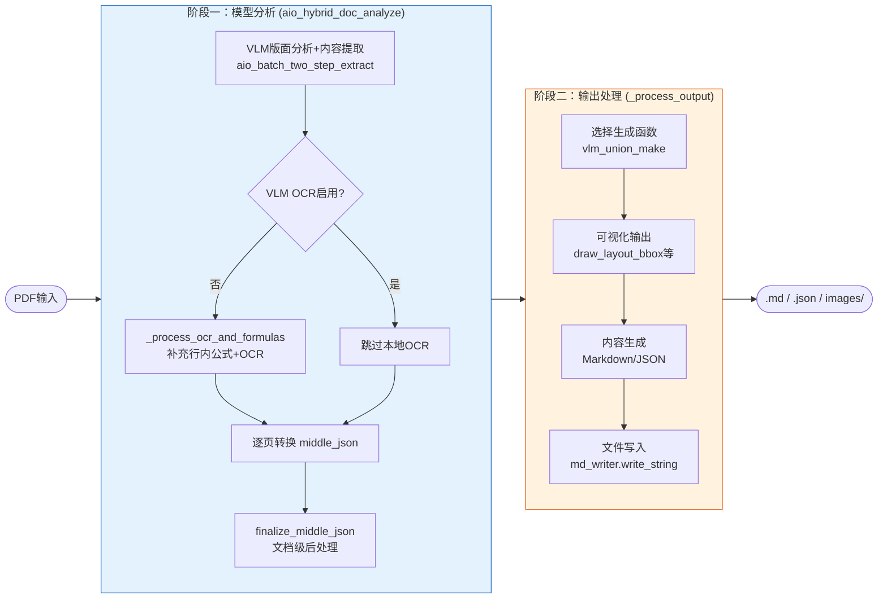
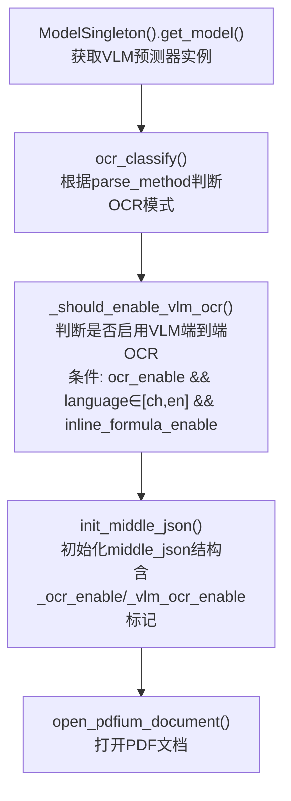
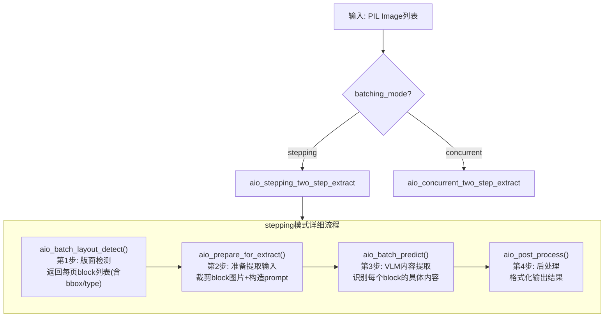
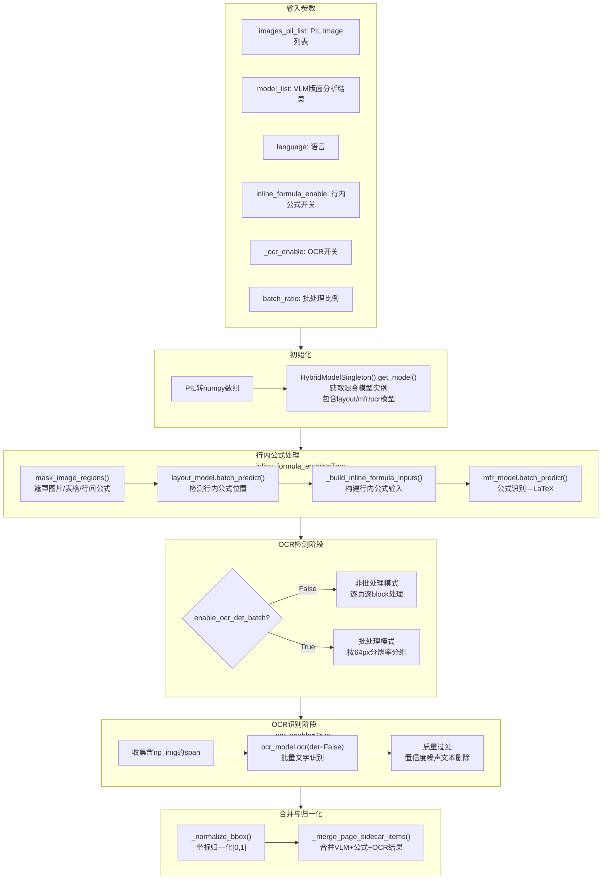
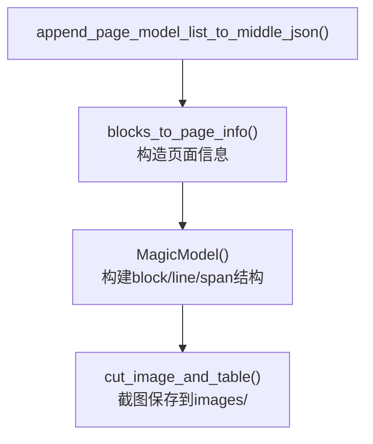
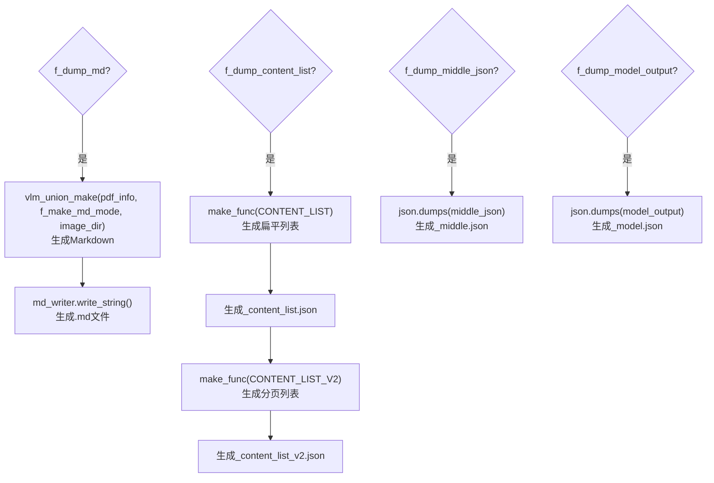
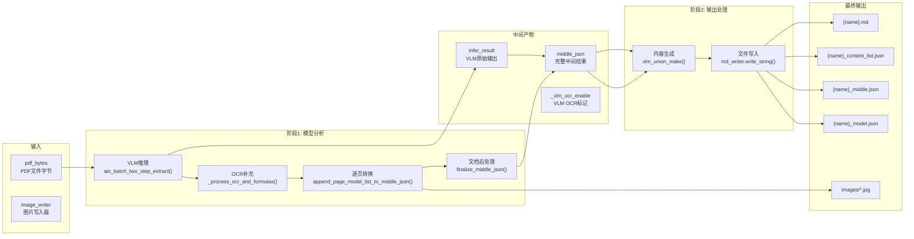

# MinerU Hybrid-Auto-Engine 工作流程详解

> **文档定位**: 详细解析 Hybrid-Auto-Engine 模式的完整工作流程，包括模型分析阶段和输出处理阶段。

---

## 总览

Hybrid-Auto-Engine 模式采用 **VLM (Vision Language Model) 端到端推理 + 传统模型补充** 的混合架构，相比传统 Pipeline 模式大幅简化了模型数量和流程复杂度。



---

## 阶段一：模型分析阶段 (aio_hybrid_doc_analyze)

**入口**: `aio_hybrid_doc_analyze()`  
**源文件**: `mineru/backend/hybrid/hybrid_analyze.py`

### 1.1 初始化阶段



### 1.2 分窗口处理循环

| 步骤 | 函数 | 作用 |
|------|------|------|
| 1 | `get_processing_window_size()` | 获取处理窗口大小（默认64页） |
| 2 | `get_batch_ratio()` | 根据显存大小计算batch_ratio（1-16） |
| 3 | `load_images_from_pdf_doc()` | 将PDF页面渲染为PIL Image列表 |

### 1.3 VLM推理核心 (aio_batch_two_step_extract)



**返回值结构**:
```python
window_model_list: list[ExtractResult]
# 每页一个ExtractResult，内部是block列表
[
    [
        {"type": "text", "bbox": [x0,y0,x1,y1], "content": "正文"},
        {"type": "table", "bbox": [...], "content": "<table>...</table>"},
        {"type": "equation", "bbox": [...], "content": "latex"},
        {"type": "image", "bbox": [...], "content": ""},
    ],
    [...]  # 第1页
]
```

### 1.4 OCR与公式补充 (_process_ocr_and_formulas)

当 `_vlm_ocr_enable=False` 时执行，补充VLM未覆盖的行内公式和OCR文本：



**详细步骤**:

| 行号 | 函数 | 作用 |
|------|------|------|
| L255 | `np_images = [np.asarray(pil_image).copy()...]` | PIL转numpy数组 |
| L258-262 | `hybrid_model_singleton.get_model()` | 获取混合模型实例 |
| L270 | `mask_image_regions(np_images, model_list)` | 涂白干扰区域 |
| L273-276 | `layout_model.batch_predict()` | 检测行内公式位置 |
| L280-284 | `mfr_model.batch_predict()` | 公式识别→LaTeX |
| L298 | `ocr_det()` | OCR文字检测 |
| L313 | `ocr_model.ocr(img_crop_list, det=False)` | OCR文字识别 |
| L400 | `_normalize_bbox()` | 坐标归一化 |
| L401-406 | `_merge_page_sidecar_items()` | 合并三类结果 |

**返回值**:
```python
return merged_model_list, hybrid_pipeline_model

# merged_model_list: 合并后的每页block列表
[
    [
        # VLM原始结果
        {"type": "text", "bbox": [...], "content": "正文"},
        {"type": "table", "bbox": [...], "content": "<table>"},
        # 行内公式（新增）
        {"type": "inline_formula", "bbox": [...], "latex": "\\sum x_i", "score": 0.95},
        # OCR文本（新增）
        {"type": "ocr_text", "bbox": [...], "text": "OCR文字", "score": 0.92},
    ],
    [...]
]

# hybrid_pipeline_model: 混合模型实例
```

### 1.5 逐页转换 middle_json



**MagicModel 构造** (`hybrid_magic_model.py`):

| 步骤 | 方法 | 功能 |
|------|------|------|
| 1 | `_split_page_model_list()` | 拆分VLM结果、行内公式、OCR结果 |
| 2 | `cal_real_bbox()` | bbox坐标转换 |
| 3 | 构建`page_blocks` | 按类型分类block |
| 4 | `get_image_blocks()` / `get_table_blocks()` / `get_text_blocks()` | 分类提取 |
| 5 | `get_all_spans()` | 获取所有span用于截图 |

### 1.6 文档级后处理 (finalize_middle_json)

| 步骤 | 函数 | 功能 |
|------|------|------|
| 1 | `_apply_post_ocr()` | 补充OCR识别（如果未启用VLM OCR） |
| 2 | `cross_page_table_merge()` | 检测并合并跨页表格 |
| 3 | `llm_aided_title()` | LLM辅助优化标题层级（可选） |

---

## 阶段二：输出处理阶段 (_process_output)

**入口**: `_process_output()`  
**源文件**: `mineru/cli/common.py`

### 2.1 准备阶段

| 行号 | 代码 | 作用 |
|------|------|------|
| L231-238 | `if process_mode == "vlm": make_func = vlm_union_make` | 选择内容生成函数 |

### 2.2 可视化输出

| 行号 | 代码 | 作用 |
|------|------|------|
| L240-245 | `if f_draw_layout_bbox: draw_layout_bbox(...)` | 生成`_layout.pdf` |
| L247-252 | `if f_draw_span_bbox: draw_span_bbox(...)` | 生成`_span.pdf` |

### 2.3 原始文件保存

| 行号 | 代码 | 作用 |
|------|------|------|
| L254-260 | `if f_dump_orig_pdf: md_writer.write(...)` | 保存`_origin.pdf` |

### 2.4 内容生成与写入



### 2.5 输出文件总览

| 文件 | 开关 | 数据来源 | 生成函数 |
|------|------|----------|----------|
| `{name}.md` | `f_dump_md` | `pdf_info` | `vlm_union_make()` |
| `{name}_content_list.json` | `f_dump_content_list` | `pdf_info` | `vlm_union_make(CONTENT_LIST)` |
| `{name}_content_list_v2.json` | `f_dump_content_list` | `pdf_info` | `vlm_union_make(CONTENT_LIST_V2)` |
| `{name}_middle.json` | `f_dump_middle_json` | `middle_json` | `json.dumps()` |
| `{name}_model.json` | `f_dump_model_output` | `model_output` | `json.dumps()` |
| `{name}_layout.pdf` | `f_draw_layout_bbox` | `pdf_info` | `draw_layout_bbox()` |
| `{name}_span.pdf` | `f_draw_span_bbox` | `pdf_info` | `draw_span_bbox()` |
| `{name}_origin.pdf` | `f_dump_orig_pdf` | `pdf_bytes` | `md_writer.write()` |
| `images/*.jpg` | 始终 | span截图 | `cut_image_and_table()` |

---

## 核心模型清单

| 模型 | 用途 | 触发条件 |
|------|------|----------|
| **VLM (Vision Language Model)** | 端到端版面分析+内容提取 | 始终 |
| **layout模型** | 行内公式位置检测 | `inline_formula_enable=True` |
| **MFR模型** | 行内公式识别→LaTeX | `inline_formula_enable=True` |
| **OCR检测模型** | 文字检测 | `_vlm_ocr_enable=False` |
| **OCR识别模型** | 文字识别 | `_ocr_enable=True` |

---

## 关键数据流转



---

## 附录：核心文件索引

| 文件 | 职责 |
|------|------|
| `mineru/backend/hybrid/hybrid_analyze.py` | `aio_hybrid_doc_analyze()` 模型分析主入口 |
| `mineru/backend/hybrid/hybrid_model_output_to_middle_json.py` | 逐页转换、MagicModel调用、finalize |
| `mineru/backend/hybrid/hybrid_magic_model.py` | MagicModel构造、block/line/span转换 |
| `mineru/cli/common.py` | `_async_process_hybrid()`、`_process_output()` |
| `mineru/backend/vlm/vlm_middle_json_mkcontent.py` | `vlm_union_make` 内容生成 |
