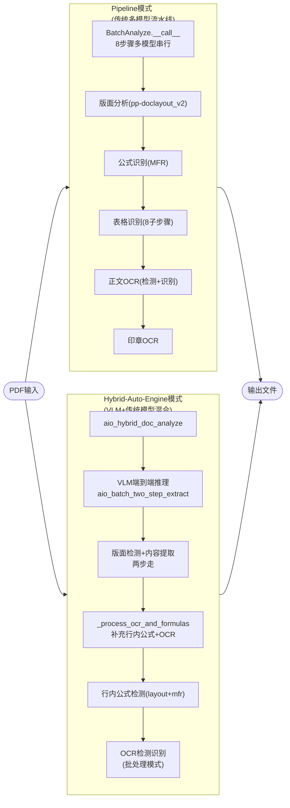
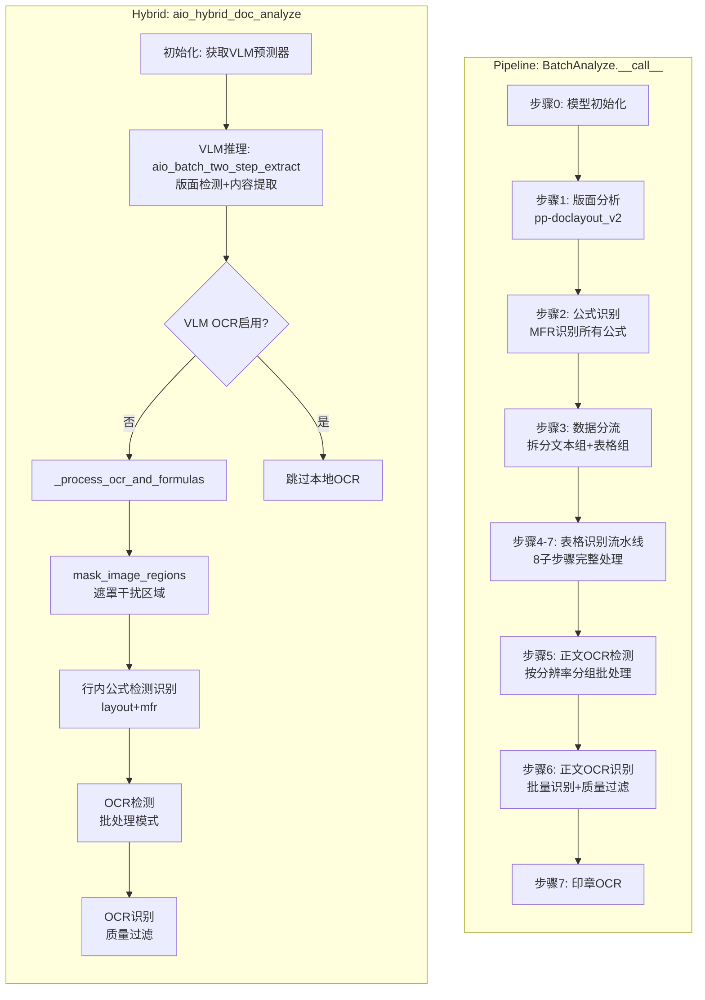
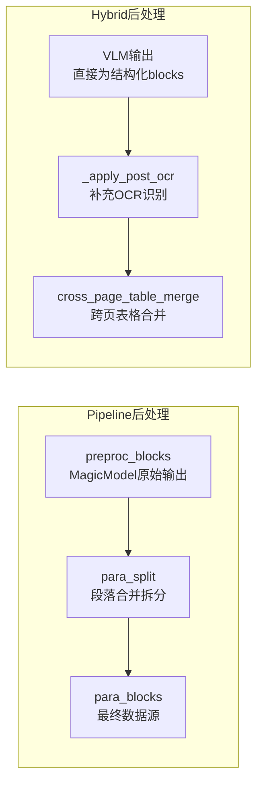
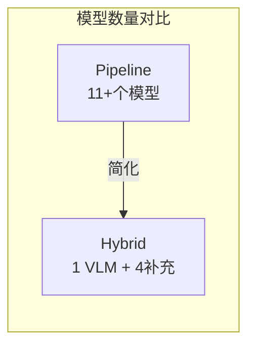
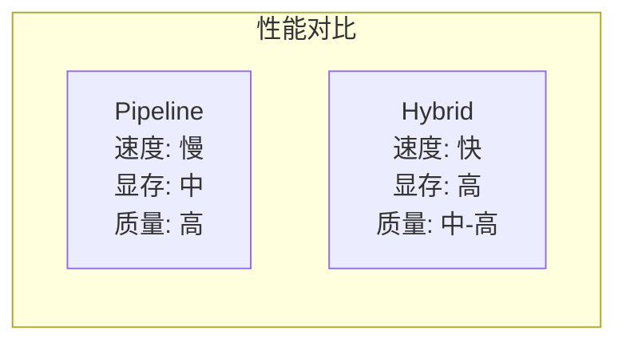
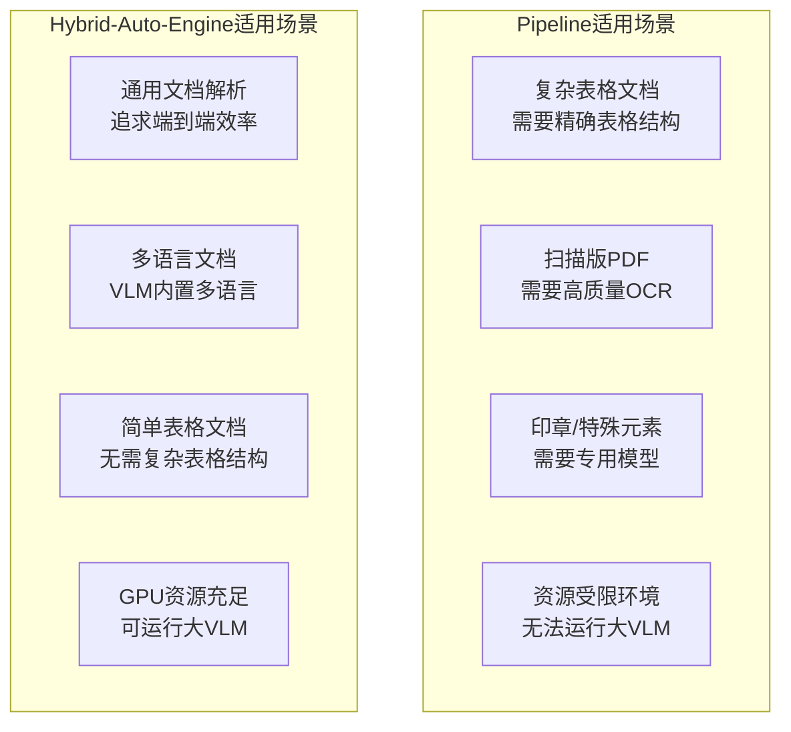
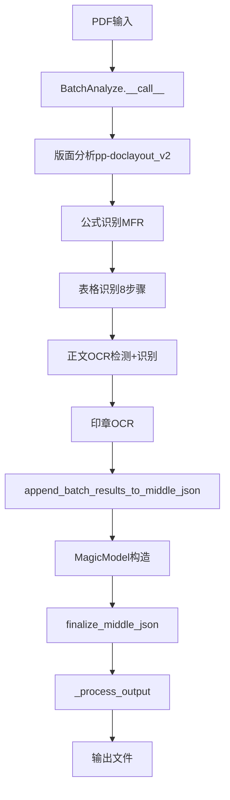
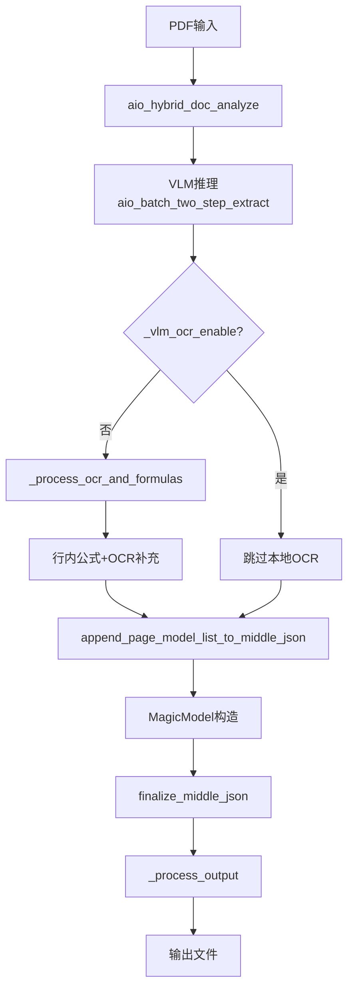

# MinerU Pipeline vs Hybrid-Auto-Engine 对比分析

> **文档定位**: 详细对比 Pipeline 模式与 Hybrid-Auto-Engine 模式在工作流程、模型使用、产物输出等方面的差异。

---

## 一、整体架构对比



---

## 二、工作流程详细对比

### 2.1 模型分析阶段对比



| 对比项 | Pipeline | Hybrid-Auto-Engine |
|--------|----------|-------------------|
| **核心引擎** | 多模型串行流水线 | VLM端到端+补充模型 |
| **版面分析** | pp-doclayout_v2 | VLM内置 |
| **公式识别** | MFR处理所有公式 | VLM提取 + MFR补充行内公式 |
| **表格识别** | 8步骤完整流水线(SLANet+/UNet等) | VLM直接输出HTML |
| **正文OCR** | 专用OCR模型检测+识别 | VLM输出 + 补充OCR |
| **印章识别** | 专用印章模型 | VLM内置 |
| **处理步骤** | 8个主要步骤 | 2个主要阶段(VLM+补充) |

### 2.2 后处理阶段对比

| 阶段 | Pipeline | Hybrid-Auto-Engine |
|------|----------|-------------------|
| **逐页转换** | `append_batch_results_to_middle_json` → `page_model_info_to_page_info` | `append_page_model_list_to_middle_json` → `blocks_to_page_info` |
| **MagicModel** | `pipeline_magic_model.py` | `hybrid_magic_model.py` |
| **文档级后处理** | `finalize_middle_json` | `finalize_middle_json`（同名但实现不同） |
| **段落处理** | `para_split` | `para_split`（Hybrid中可能简化） |
| **跨页表格合并** | `cross_page_table_merge` | `cross_page_table_merge` |
| **LLM辅助标题** | `llm_aided_title` | `llm_aided_title` |



---

## 三、模型使用对比

### 3.1 Pipeline 模式使用的模型

| 步骤 | 模型 | 作用 |
|------|------|------|
| 1 | **pp-doclayout_v2** | 版面分析，检测text/table/image/formula/seal区域 |
| 2 | **MFR (Math Formula Recognition)** | 公式识别，输出LaTeX |
| 3 | **旋转分类模型** | 判断表格方向 |
| 4 | **有线/无线分类模型** | WirelessTable/WiredTable分类 |
| 5 | **表格OCR检测** | 表格内文字检测 |
| 6 | **表格OCR识别** | 表格内文字识别 |
| 7 | **SLANet+** | 无线表格结构识别 |
| 8 | **UNet** | 有线表格结构识别 |
| 9 | **正文OCR检测模型** | 文本区域检测 |
| 10 | **正文OCR识别模型** | 文本内容识别 |
| 11 | **印章OCR模型** | 印章检测+识别 |

**总计：11+个模型，8个主要步骤**

### 3.2 Hybrid-Auto-Engine 模式使用的模型

| 阶段 | 模型 | 作用 |
|------|------|------|
| **核心** | **VLM (Vision Language Model)** | 端到端版面分析+内容提取 |
| 补充1 | **layout模型** | 行内公式位置检测（仅当inline_formula_enable=True） |
| 补充2 | **MFR模型** | 行内公式识别→LaTeX |
| 补充3 | **OCR检测模型** | 文字检测（VLM未覆盖的文本） |
| 补充4 | **OCR识别模型** | 文字识别 |

**总计：1个VLM + 4个补充模型**

### 3.3 模型数量对比



| 模型类型 | Pipeline | Hybrid |
|----------|----------|--------|
| 版面分析 | pp-doclayout_v2 | VLM内置 |
| 公式识别 | MFR | VLM + MFR补充 |
| 表格识别 | SLANet+/UNet/分类模型等 | VLM内置 |
| OCR | 专用检测+识别模型 | VLM + OCR补充 |
| 印章 | 专用模型 | VLM内置 |

---

## 四、产物对比

### 4.1 输出文件对比

| 文件 | Pipeline | Hybrid-Auto-Engine | 说明 |
|------|----------|-------------------|------|
| `{name}.md` | ✅ `pipeline_union_make` | ✅ `vlm_union_make` | Markdown内容 |
| `{name}_content_list.json` | ✅ | ✅ | 扁平内容列表V1 |
| `{name}_content_list_v2.json` | ✅ | ✅ | 分页内容列表V2 |
| `{name}_middle.json` | ✅ | ✅ | 完整中间结果 |
| `{name}_model.json` | ✅ | ✅ | 模型原始输出 |
| `images/*.jpg` | ✅ | ✅ | 裁剪图片 |
| `{name}_layout.pdf` | ✅ | ✅ | 版面可视化 |
| `{name}_span.pdf` | ✅ | ❌（默认False） | Span可视化 |

### 4.2 middle_json结构对比

**Pipeline模式：**
```json
{
  "pdf_info": [...],
  "_backend": "pipeline",
  "_ocr_enable": true,
  "_version_name": "1.x.x"
}
```

**Hybrid模式：**
```json
{
  "pdf_info": [...],
  "_backend": "hybrid",
  "_ocr_enable": true,
  "_vlm_ocr_enable": true/false,  // 新增字段
  "_version_name": "1.x.x"
}
```

---

## 五、性能与资源对比

| 对比项 | Pipeline | Hybrid-Auto-Engine |
|--------|----------|-------------------|
| **显存需求** | 中等（多模型加载） | 高（VLM大模型） |
| **推理速度** | 较慢（多模型串行） | 快（VLM端到端） |
| **表格识别质量** | 高（专用模型优化） | 中等（依赖VLM能力） |
| **公式识别质量** | 高（MFR专用优化） | 高（VLM+MFR补充） |
| **OCR准确性** | 高（专用OCR模型） | 依赖VLM能力 |
| **多语言支持** | 需单独配置 | VLM内置多语言 |
| **部署复杂度** | 高（11+模型管理） | 低（主要1个VLM） |



---

## 六、适用场景对比



| 场景 | 推荐模式 | 原因 |
|------|----------|------|
| 财务报表/复杂表格 | Pipeline | 表格结构精确度高 |
| 扫描版古籍/低质量PDF | Pipeline | OCR质量更可靠 |
| 通用办公文档 | Hybrid | 速度快、部署简单 |
| 多语言混合文档 | Hybrid | VLM内置多语言支持 |
| 实时处理需求 | Hybrid | 推理速度快 |
| 边缘设备部署 | Pipeline | 显存要求低 |

---

## 七、核心代码入口对比

| 模式 | 主入口 | 关键文件 |
|------|--------|----------|
| **Pipeline** | `_process_pipeline()` in `cli/common.py` | `mineru/backend/pipeline/batch_analyze.py`<br/>`mineru/backend/pipeline/pipeline_analyze.py` |
| **Hybrid** | `_async_process_hybrid()` in `cli/common.py` | `mineru/backend/hybrid/hybrid_analyze.py`<br/>`mineru/backend/hybrid/hybrid_model_output_to_middle_json.py` |

---

## 八、总结对比表

| 维度 | Pipeline | Hybrid-Auto-Engine |
|------|----------|-------------------|
| **架构** | 多模型串行流水线 | VLM端到端+轻量补充 |
| **模型数量** | 11+ | 1 VLM + 4补充 |
| **核心引擎** | pp-doclayout_v2 + MFR + OCR + 表格模型 | VLM (Vision Language Model) |
| **表格处理** | 专用8步骤流水线(SLANet+/UNet等) | VLM直接生成HTML |
| **公式处理** | MFR统一处理 | VLM + MFR补充行内公式 |
| **OCR处理** | 专用检测+识别模型 | VLM内置 + OCR补充 |
| **部署复杂度** | 高 | 低 |
| **推理速度** | 慢 | 快 |
| **显存需求** | 中 | 高 |
| **准确性** | 高（特定场景） | 依赖VLM能力 |
| **多语言** | 需配置 | 内置支持 |
| **趋势** | 传统方案 | 未来主流方向 |

---

## 九、数据流转对比

### Pipeline 数据流转



### Hybrid 数据流转



---

## 附录：核心文件索引

### Pipeline 相关文件

| 文件 | 职责 |
|------|------|
| `mineru/backend/pipeline/batch_analyze.py` | `BatchAnalyze.__call__` 模型分析主入口 |
| `mineru/backend/pipeline/pipeline_analyze.py` | Pipeline调度、批次处理、文档切分 |
| `mineru/backend/pipeline/model_json_to_middle_json.py` | 阶段A+B核心逻辑、MagicModel调用 |
| `mineru/backend/pipeline/pipeline_magic_model.py` | MagicModel构造、block/line/span体系转换 |
| `mineru/backend/pipeline/para_split.py` | 段落合并拆分逻辑 |
| `mineru/backend/pipeline/pipeline_middle_json_mkcontent.py` | `pipeline_union_make` 内容生成 |

### Hybrid 相关文件

| 文件 | 职责 |
|------|------|
| `mineru/backend/hybrid/hybrid_analyze.py` | `aio_hybrid_doc_analyze` 模型分析主入口 |
| `mineru/backend/hybrid/hybrid_model_output_to_middle_json.py` | 逐页转换、finalize逻辑 |
| `mineru/backend/hybrid/hybrid_magic_model.py` | MagicModel构造 |
| `mineru/backend/vlm/vlm_middle_json_mkcontent.py` | `vlm_union_make` 内容生成 |

### 公共文件

| 文件 | 职责 |
|------|------|
| `mineru/cli/common.py` | `_process_pipeline`、`_async_process_hybrid`、`_process_output` |
| `mineru/data/data_reader_writer/` | `DataWriter`抽象、本地/S3写入实现 |
